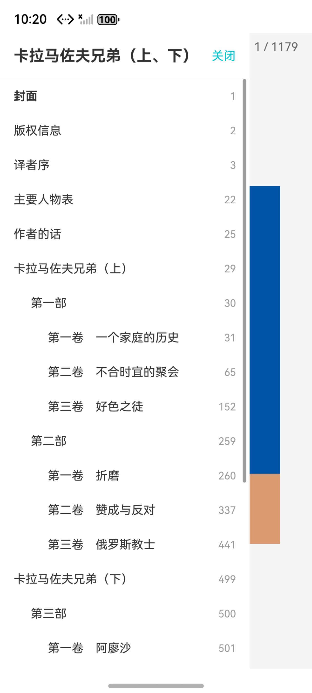

# Reader

一款基于 HarmonyOS 的电子书阅读应用，提供流畅的阅读体验和丰富的书籍管理功能。

## 功能特点

### 📚 书架
- 书籍分类浏览，支持按哲学、文学、编程等主题筛选
- 支持按书名或作者名搜索
- 一键收藏喜欢的书籍


### 📖 阅读
- 舒适的阅读界面，清晰的字体排版
- 目录导航，快速跳转到任意章节
- 实时阅读进度显示


### ⭐ 收藏
- 便捷的收藏管理，快速访问收藏书籍


### 📅 历史
- 完整的阅读记录追踪
- 阅读时长与页数统计
- 按日期浏览历史记录


### 👤 我的
- 阅读数据统计（阅读时长、阅读页数、阅读书籍数）
  

## 技术架构

采用 HarmonyOS 模块化设计，主要模块包括：

- **entry**: 应用主入口
- **common**: 公共组件库
- **features/bookshelf**: 书架模块
- **features/history**: 历史记录模块
- **features/mine**: 个人中心模块
- **features/login**: 登录模块

## 项目结构

```
Reader/
├── entry/                 # 应用主入口
├── common/                # 公共组件库
├── features/              # 功能模块
│   ├── bookshelf/        # 书架模块
│   ├── history/          # 历史记录模块
│   ├── mine/             # 个人中心模块
│   └── login/            # 登录模块
├── docs/                  # 文档与截图
└── AppScope/             # 应用全局配置
```
